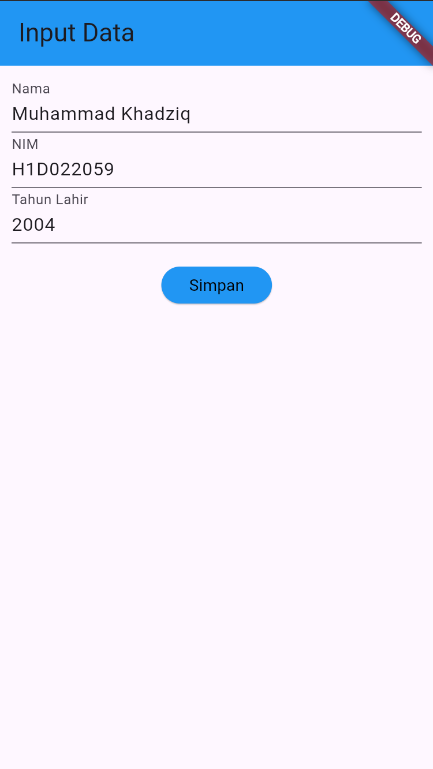

# Tugas Pertemuan 2

PROSES PASSING DATA DARI FORM MENUJU TAMPILAN

- Di dalam widget `FormData`, terdapat tiga '`extField` yang digunakan untuk mengumpulkan data dari pengguna: nama, NIM, dan tahun lahir. 
- Setiap `TextField` memiliki `TextEditingController` yang berfungsi untuk menangkap input dari pengguna.
- Ketika tombol "Simpan" ditekan, fungsi `onPressed` pada tombol tersebut akan dipanggil. Pada fungsi ini, nilai dari tiga `TextEditingController` (untuk nama, NIM, dan tahun) akan diambil menggunakan properti `.text`.
- Setelah mendapatkan data dari form, aplikasi melakukan navigasi ke halaman baru, yaitu `TampilData`. Navigasi ini dilakukan dengan memanggil `Navigator.of(context).push()`, di mana halaman baru `(TampilData)` dibangun dengan data yang dipassing melalui konstruktor `TampilData`.
- Di dalam file `tampil_data.dart`, data yang dipassing dari halaman `FormData` (nama, NIM, dan tahun) diterima sebagai parameter di konstruktor `TampilData`.
- Data ini kemudian digunakan untuk menghitung umur pengguna (berdasarkan tahun lahir), dan ditampilkan dalam format teks menggunakan widget Text.

Nama : Muhammad Khadziq

NIM : H1D022059

Shift Baru: SHIFT C

## Screenshot

